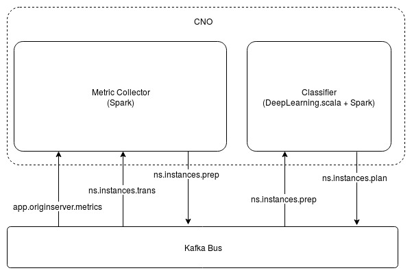

# SS-CNO: UHDoCDN Classifier

This component is part of the [5G-MEDIA MAPE service](https://github.com/5g-media/mape).

# Introduction

This repository includes the code for the traffic classifier of vCDN service (UC3), also known as, Ultra HD over Content Delivery Network (UHDoCDN).
The role of the classifier is to decide whether an optimization action, i.e. `scale-out` or `scale-in` should be executed, and issues the
appropriate command to MAPE executor.

The Classifier receives a feature vector from a Metric Collector application. The following schematic depicts the communication of the
Metric Collector application and the Classifier through the central Kafka Bus.



The feature vector includes metrics from Plesk server, application-level (vCache) and infrastructure metrics. The Classifier decides 
if the input measurements, in form of a feature vector are `regular` or `irregular`. Aftewards, its actions might be one of the following:

  * In case of `regular` measurements, no action is needed, whether there has been a previous `scale-out` or not;
  * In case of `irregular` measurements a `scale-out` action will be triggered, provided that the system is able to spawn another vCache;
  * If case the measurements are `regular`, but a vCache is not utilized, a `scale-in` event will be triggered. 

The above information summarize the overall operation of the UHDoCDN Classifier. For implementation details and installation guides please
see the following.

## Implementation

### Employed Technology

For the implementation of this version of the Classifier the [Deeplearning.scala](https://deeplearning.thoughtworks.school/) has been
utilized, which is "*simple library for creating complex neural networks*". Indeed, by utilizing this library we were able to quickly
deploy and train a neural network, able to classify the received feature vectors as `regular` or `irregular`. Based on the collected
training set, we trained the neural network repeatedly and finally defined the model's weights as the ones that gave us the smaller loss.

### Collection of Training Data

No existing dataset could be found for the training of the utilized neural network. Ergo, a need for the creation of a custom dataset emerged. The idea behind the creation of this dataset was to recreate the `regular`, `irregular` states of the system and perform manual classifications by observing the quality of the streamed content while recording the collection of the selected measurements.

For the introduction of background traffic [iPerf](https://iperf.fr/) was utilized. The tests that were executed for the collection of measurements included a variable number of connected clients and variable values of background traffic. During the conducted tests, a tester visually classified the delivered content as `regular` or `irregular`, recording the timestamps of the transitions so that the recorded feature vectors could be labeled and fed to the neural network for training purposes. After the collection of the aforementioned dataset, a normalization of the collected data followed, a procedure considered essential for the convergence and correct operation of the neural network. 

The aforementioned procedures led to the construction of a dataset of manually labeled feature vectors. The acquirement of this dataset was followed by the training of the neural network. We experimented with a variety of learning rates, initial weight and number of iterations (epochs). When the neural network’s accuracy was considered satisfying the neural network was frozen, i.e. the optimal weights were recorded and the algorithm was considered ready for deployment. 

## Installation Guide

The UHDoCDN traffic classifier is deployed as a Docker container, utilizing docker-compose. In the following, instructions for the
installation of prerequisites and actual deployment are provided.

### Prerequisites

For the deployment of the Cognitive Network Optimizer the Docker engine as well as docker-compose should be installed.
These actions can be performed following the instructions provided below. Firstly, an update should be performed
and essential packages should be installed:

```bash
sudo apt-get update
sudo apt-get install -y \
     apt-transport-https \
     ca-certificates \
     curl \
     software-properties-common
```

Secondly the key and Docker repository should be added:

```bash
curl -fsSL https://download.docker.com/linux/ubuntu/gpg | sudo apt-key add -
sudo add-apt-repository \
     "deb [arch=amd64] https://download.docker.com/linux/ubuntu \
     $(lsb_release -cs) \
     stable"
```

Then another update is performed, Docker is installed and the user is added to docker group.

```bash
sudo apt-get update
sudo apt-get install -y docker-ce
sudo groupadd docker
sudo usermod -aG docker $USER
```

Finally, docker-compose should be installed:

```bash
sudo curl -L "https://github.com/docker/compose/releases/download/1.24.0/docker-compose-$(uname -s)-$(uname -m)" -o /usr/local/bin/docker-compose
sudo chmod +x /usr/local/bin/docker-compose
```

### Environmental Variables

| Variable Name | Description |
| ------------- | ----------- |
| COMPOSE_PROJECT_NAME | The name of the project |
| UHDOCDN_KAFKA_HOST | The Kafka Host to connect |
| UHDOCDN_SPARK_PORT | The Spark port to expose |
| UHDOCDN_OUTPUT_OP | The output operation (`print`, `publish_to_exec`) |

### Deployment

The UHDoCDN Classifier is deployed as a single Docker container, utilizing docker-compose. Having cloned the
code of this repository, and having created the .env file in the this directory the following  command should 
be executed to trigger the building of the image and its subsequent deployment:

```bash
docker-compose up -d --build
```

## Authors
- Singular Logic

## Contributors
 - Contact with Authors
 
## Acknowledgements
This project has received funding from the European Union’s Horizon 2020 research and innovation programme under grant agreement No 761699. The dissemination of results herein reflects only the author’s view and the European Commission is not responsible for any use that may be made of the information it contains.

## License
[Apache 2.0](LICENSE.md)